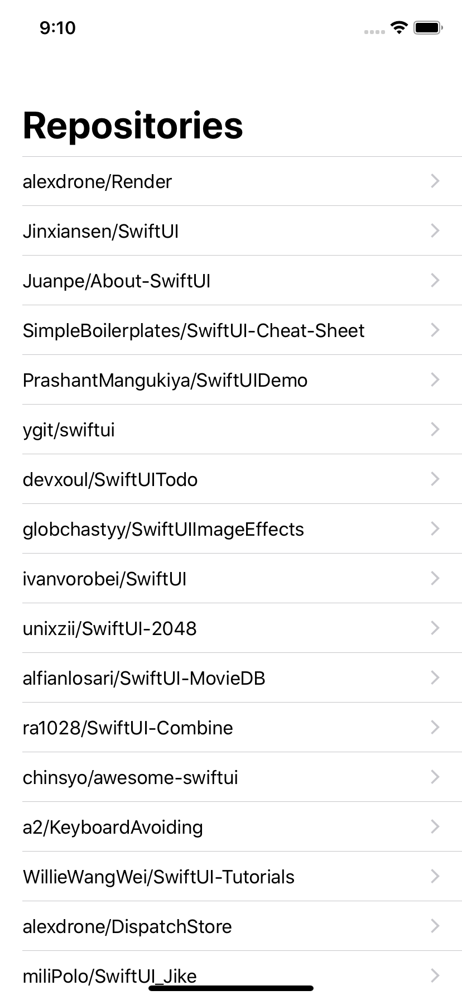

# SwiftUI-Redux

Redux enables us to have unidirectional data flow and make it testable on top of Flux. It's used to be implemented using RxSwift or ReactiveSwift in the past, but I use Combine this time. This is an experimental project using SwiftUI + Redux.

## Caution

Architecture of this project might not be pure Redux. There is a high chance that my idea of Redux/ReSwift is partially wrong.

## Requirements

Xcode 11.0 Beta 5+  
Swift 5.1+

## More examples

See other architectures as well

- Flux: https://github.com/mobileANDweb/Flux-SwiftUI
- MVVM: https://github.com/mobileANDweb/MVVM-SwiftUI
